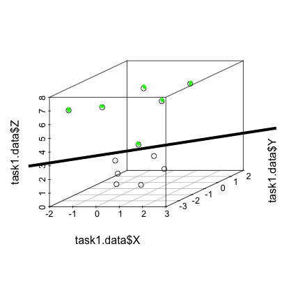
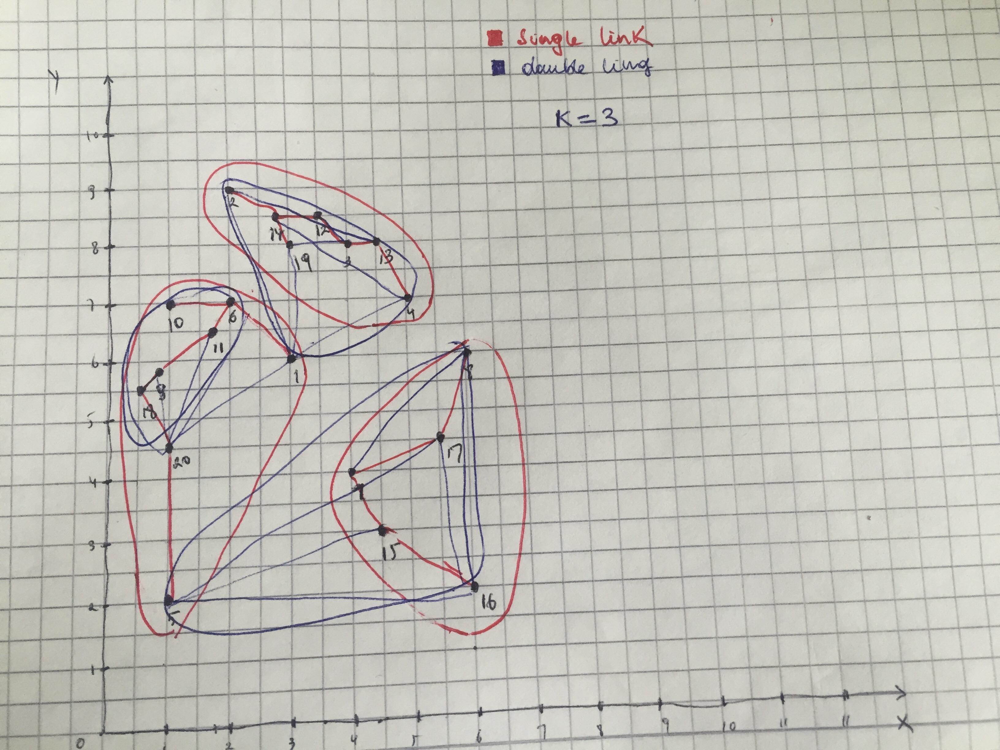
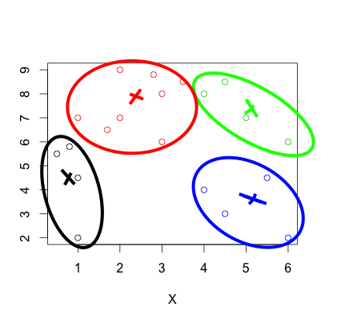

HW11 (25.04) - ML, Clustering, projects...


1. Load the dataset from here (or csv version). The data points belong to two classes - positives and negatives. Notice that two classes are not linearly separated in the original 2D feature space. However, by applying the "kernel trick" we can map the original feature space into a high dimensional one where the classes would be linearly separable. Try to come up with new feature(s) based on X and Y, such that the given points would be separable. (Hint)

```{r, echo=FALSE, message=FALSE, echo=FALSE, warning=FALSE}
library(e1071)
library(ggplot2)
library(rpart)
library(Rglpk)
library(scatterplot3d)
task1 = read.csv("task1_dataset")
task2 = read.csv("Clustering.csv")
task1 = task1[,-1]
task2 = task2[,-1]
task1.data = task1
```


To achive this task I had to apply the kernel trik in this way.

First I plotter the point to make sure that they are not lieanrly separable as it can be seen on the very first plot.
For me to make sure that elevation works.
Since all the red points are in the middle I decided to shift the point (0,0) to the middle with respect to the class 1.
Now after that is done, I can add my trick "Z" so that all red points since they are close to the center the will be less elevated by applying this formula. z = x^2 + y^2. as it can be seen the in the image number 2.
So at the end I have plotted in 3d so we can get the linear separation.

```{r}
plot(task1.data[,1:2],col=(3 - task1.data$Class))
task1.data$X = task1.data$X  - mean(task1.data$X[which(task1.data$Class == 1)])
task1.data$Y = task1.data$Y  - mean(task1.data$Y[which(task1.data$Class == 1)])
plot(task1.data[,1:2],col=(3 - task1.data$Class))
plot(task1.data[,1:2],col=(3 - task1.data$Class))
task1.data$Z = (task1.data$X^2 + task1.data$Y^2)
task1.data
scatterplot3d(task1.data$X, task1.data$Y,task1.data$Z )
#scatterplot3d(task3$X,task3$Y,task3.kmeans$cluster,color = task3.kmeans$cluster )
#scatterplot3d()
#table(pred = svm.pred, true= svm.tested)
```



One problem I had is that for this task R was plotting the cube in black and white to show the different points so I did it manually.


2. Load dataset from this Excel file (or csv version). Your task is to simulate hierarchical clustering:

Single link (min distance) clustering
Complete link (max distance) clustering
Use common sense, no need to calculate ALL distances. Draw by hand to save time...



The achievement of this task was a bit tricky and confusing I can say, so this is what I did.

 + Find 2 clusters with minimal distance 
 
 + Join them
 
 + Repeat the 1 and 2 until you get your minimun K in this case, my K is 3
 
 Single link | Complete link
 ------------|--------------
 nearest 2 clusters | furthest 2 points distances 
 Single link (min distance) clustering | Complete link (max distance) clustering

* In statistics, single-linkage clustering is one of several methods of hierarchical clustering. It is based on grouping clusters in bottom-up fashion (agglomerative clustering), at each step combining two clusters that contain the closest pair of elements not yet belonging to the same cluster as each other.
A drawback of this method is that it tends to produce long thin clusters in which nearby elements of the same cluster have small distances, but elements at opposite ends of a cluster may be much farther from each other than to elements of other clusters. This may lead to difficulties in defining classes that could usefully subdivide the data.

* Complete-linkage clustering is one of several methods of agglomerative hierarchical clustering. At the beginning of the process, each element is in a cluster of its own. The clusters are then sequentially combined into larger clusters until all elements end up being in the same cluster. At each step, the two clusters separated by the shortest distance are combined. The definition of 'shortest distance' is what differentiates between the different agglomerative clustering methods. In complete-linkage clustering, the link between two clusters contains all element pairs, and the distance between clusters equals the distance between those two elements (one in each cluster) that are farthest away from each other. The shortest of these links that remains at any step causes the fusion of the two clusters whose elements are involved. The method is also known as farthest neighbour clustering. The result of the clustering can be visualized as a dendrogram, which shows the sequence of cluster fusion and the distance at which each fusion took place.(wikipedia)
 

3. Use the same data, and use first 4 points as K cluster centers for K-means. Simulate the K-means (using Euclidean distance). Again, use common sense and approximate distances where needed. When in serious doubt, you can rely on more precise calculations.

```{r, echo=FALSE}
set.seed(4)
task3 = task2
task3.kmeans = kmeans(task3,4)
plot(task3, col=task3.kmeans$cluster)
#scatterplot3d(task3$X,task3$Y,task3.kmeans$cluster,color = task3.kmeans$cluster )
```



As explained in class, I have taken the first 4 points and then I have done the kmeans.


4 and 5 have been added to the google slides file and they have also been submitted by my team mates 


