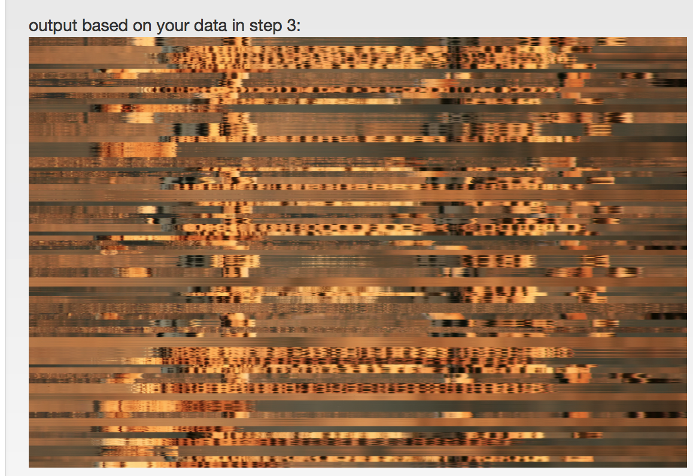
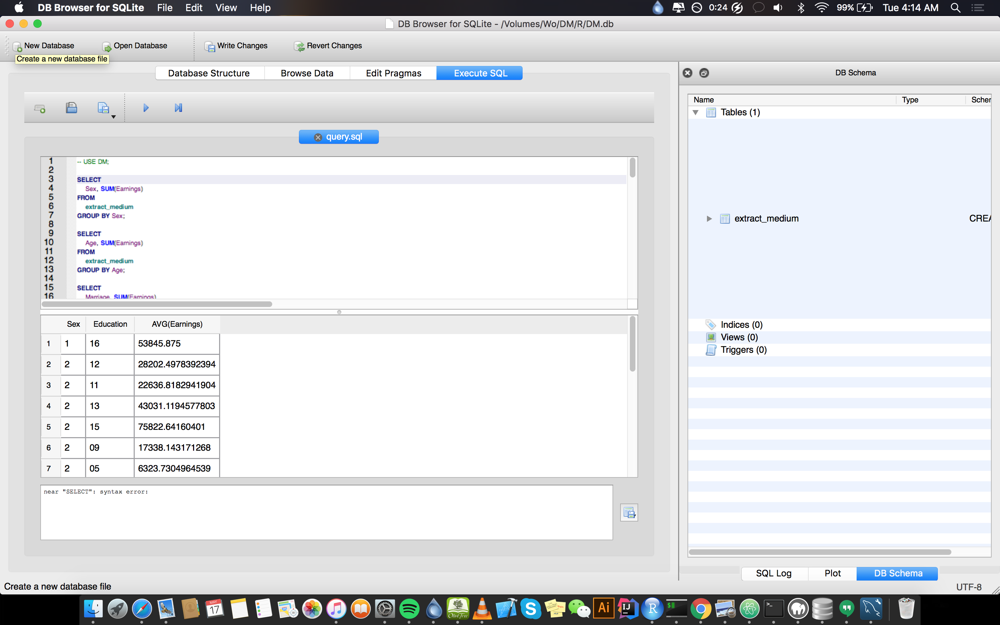

There is an image with shuffled rows - http://biit.cs.ut.ee/imgshuffle/index.cgi?fname=DM2016&dname=DM2016 You can

get access to RGB values in here - http://biit.cs.ut.ee/imgshuffle/data/DM2016/DM2016.txt (uploaded file here)
You can re-order row id's in any order and upload them to the same webpage to recover image in that new order of rows.
New image for those who know what is in the first image and want to have fun finding out what's in the picture (txt file).

1. Apply any clustering techniques (hierarchical, SOM, K-Means) that you wish and try to recover what is pictured on the image.

```{r, echo = FALSE }
cldata =  read.table("DM2016.txt", sep = ' ', header = FALSE)
datarow <- data.frame(cldata[,-1], row.names=cldata[,1]) # //with head and rownames

kmeans60<- kmeans(datarow[,1:1921], centers = 60) #using centers 60
sortedk60 <- sort(kmeans60$cluster, decreasing = FALSE)
#write(names(sortedk60), "ninja.txt", sep="\n") #creates the clustersx

```
For this task I use Kmeans to achieve this but the image still too fuzzy to show any distinct difference from original image given. 


2. Use the same data matrix from task 1 and run a PCA analysis on it. Plot first three principal components as 2-dimensional plots PC1-PC2, PC1-PC3, PC2-PC3 of these data or as a 3D plot. Check out PCA example

```{r,echo=FALSE, message=FALSE, warning=FALSE}

library(ggplot2)
library(reshape)
library(e1071)
library(devtools)
library(rpivotTable)
pcadata <- prcomp(datarow[, 1:100], center = TRUE, scale. = TRUE)

```
For this question I had some DLL issues since I am on mac and the library I want to use apparently only works on windows I couldn't move forward with the question 

```{r, echo=FALSE}
sumry = summary(pcadata)
plot(sumry$rotation, col= c(1:4))
```

3. Grab US census data (e.g. medium size) in here - http://biit.cs.ut.ee/~vilo/edu/Data/census2000/ Make Pivot table summary about people's earnings based on various variables. E.g. the gender and education level. Make sure to apply heatmaps on top of pivot table.

```{r}
census2000 = read.csv("extract_medium.csv", sep = ";", header = T)
cast(census2000, Education ~ Sex)#Sex + Education)
#pca3d(pcadata, group=data[,1], bg = "grey")

```

4. On the same data - try to visualize other relationships in data - based on ancestry, industry, marital status and education, for example.
```{r}

```
5. Read the Jim Gray - Data Cube abstraction. Describe the key operators from this article using examples based on above census data (tasks 3-4). (Alternative list of operations - https://en.wikipedia.org/wiki/OLAP_cube#Operations )

+ ***Dice:*** The dice operation produces a subcube by allowing the analyst to pick specific values of multiple dimensions.[5] The picture shows a dicing operation: The new cube shows the sales figures of a limited number of product categories, the time and region dimensions cover the same range as before. 

+ ***Drill Down/Up ***  allows the user to navigate among levels of data ranging from the most summarized (up) to the most detailed (down).[4] The picture shows a drill-down operation: The analyst moves from the summary category "Outdoor-Schutzausrüstung" to see the sales figures for the individual products.

+ ***Roll-up: *** A roll-up involves summarizing the data along a dimension. The summarization rule might be computing totals along a hierarchy or applying a set of formulas such as "profit = sales - expenses".

+ ***Pivot*** allows an analyst to rotate the cube in space to see its various faces. For example, cities could be arranged vertically and products horizontally while viewing data for a particular quarter. Pivoting could replace products with time periods to see data across time for a single product

6. (Bonus 2p) Attempt running a TSP or other techniques to recover as well as possible the original image of tasks 1.-2.

```{r}

```


7. (Bonus 2p) Load the same census data sets (you can attempt larger ones, too) into a DB and run SQL queries to achieve summarization as in pivot tables.



```
USE DM;

SELECT 
    Sex, SUM(Earnings)
FROM
    extract_medium
GROUP BY Sex;

SELECT 
    Age, SUM(Earnings)
FROM
    extract_medium
GROUP BY Age;

SELECT 
    Marriage, SUM(Earnings)
FROM
    extract_medium
GROUP BY Marriage;

SELECT 
    Sex, Education, AVG(Earnings)
FROM
    extract_medium
GROUP BY Education
ORDER BY Earnings DESC;

SELECT 
    State, Education, Sex, Age, Earnings
FROM
    extract_medium
WHERE
    Earnings < ANY (SELECT 
            Earnings
        FROM
            extract_medium)
        AND Sex = 1;


SELECT 
    State, Education, Sex, Age, Earnings
FROM
    extract_medium
WHERE
    Earnings < ANY (SELECT 
            Earnings
        FROM
            extract_medium
        WHERE
            Education < 14)
        AND Sex = 1
ORDER BY Earnings DESC;


SELECT 
    AVG(Earnings)
FROM
    extract_medium
WHERE
    Sex = 1 AND Marriage = 1
LIMIT 0 , 25000;


SELECT 
    AVG(Earnings)
FROM
    extract_medium
WHERE
    Sex = 1 AND Marriage = 2
LIMIT 0 , 25000;

SELECT 
    AVG(Earnings)
FROM
    extract_medium
WHERE
    Sex = 1 AND Marriage = 3
LIMIT 0 , 25000;

SELECT 
    AVG(Earnings)
FROM
    extract_medium
WHERE
    Sex = 1 AND Marriage = 4
LIMIT 0 , 25000;

SELECT 
    AVG(Earnings)
FROM
    extract_medium
WHERE
    Sex = 1 AND Marriage = 5
LIMIT 0 , 25000;
```


For this task I wanted to use phpMyAdmin but I got into some issues so I decided to USE and simple SQLite browser to import the 
csv file as a table into my database. 

Generating a table that provides a view of a group in relation to their total earnings by age group,
is inferred that age any age group below 16 i.e 15 and below are not included earn anything:
it could therefore be concluded that thoses are not the workforce.

Subset and summarizing data by level of marrige / total status of the state of marraige May 1
categories, one could infer that group marraige was more gains than other
while state 5 also follows.

From there, people without education, which is 0 with a level of training is no gain due
their average scores of profits to zero.

Then rotate the column Gender, education and Averaige actually gain understanding
comparison earning next to the other in education, i.e how education influences their
earnings. And so, it is understood that as education levels 15 and 16 recieves more
average earnings than others, while 15 to be precise have an advantage over 16. In general, the gains
Education seems parallel in its sum.

Make more complex swivel abstract state, among others, were included for a low
employees are considered and its interesting to see that most of those from the state
Arizona.

Then, finally, using the similar request before, but this time knowing those earning high and
the less the wiht education. As previously inferred, gender 1 gets higher earnings, most if not all
that comes from Carlfonia state. This could mean higher income or standard of living in this
American side with large companies paysw well ... and also to the above, has also noticed the
The higher your level of education, the higher your winnings.


## Question 3 and 4 

```{r}
rpivotTable(data = census2000, rows = "House_relation",cols = c("Sex","Education") , rendererName = "Heatmap")
rpivotTable(data = census2000, rows = "Ancestry",cols = c("Education") , rendererName = "Heatmap")
```