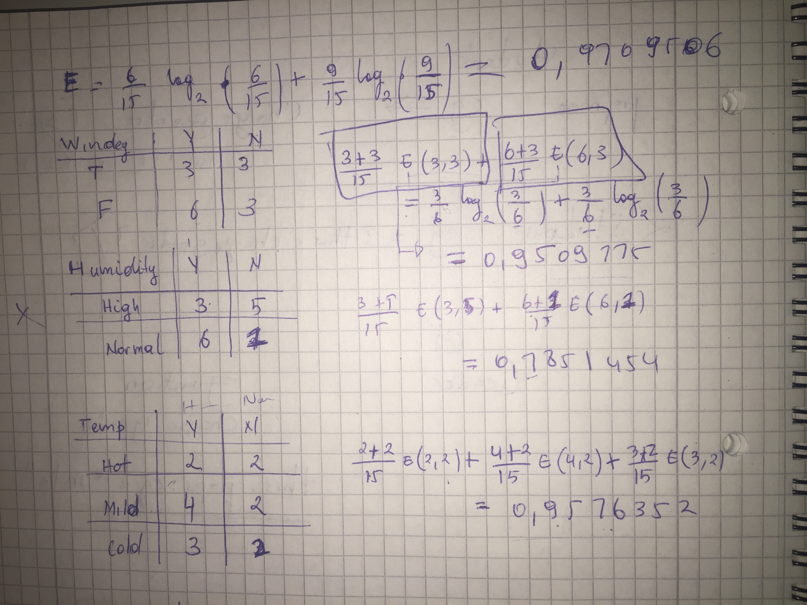

```{r, echo=FALSE, results='hide', echo=FALSE, message=FALSE, warning=FALSE}
library(rpart)
library(rplotengine)
library(entropy)
library(class) 
library(e1071) 
library(rattle)
library(rpart.plot)
library(RColorBrewer)
```

1. Read - http://www.r2d3.us/visual-intro-to-machine-learning-part-1/ What is the quality of the classifier? Can you understand when it works well and when not?


I might be the only person who finds this question tricky but from what understand, 
A good classifier is the one that classify data with a maximum of accuray. During my reading of the given article 
I have discovered that we can have different methods of classifying data. For example a scatter plot and histogram extc... but those method can have problem and give some wrong outputs sometimes. That's why machine learning introduced a decision tree. A decision tree is normaly trained to classify data with zero errors, but it can happen that it does make mistakes, and that is called overfitting.

***Overfitting*** occurs when a statistical model describes random error or noise instead of the underlying relationship. Overfitting generally occurs when a model is excessively complex, such as having too many parameters relative to the number of observations


2. Use this small data example and build a decision tree (manually, explaining all steps/choices).


ord.      | Outlook |	Temp	  | Humidity |	Windy |	Play
----------|---------|---------|----------|--------|----------
1.        |  Sunny  |	 Hot	  | High     |	FALSE |	No    
2.        |  Sunny	|  Hot	  | High	   | TRUE	  |  No    
3.        | Overcast|  Hot	  |High	     | FALSE  |Yes
4.        |  Rainy	|  Mild	  |High	     | FALSE	|Yes
5.        |  Rainy	|  Cool	  |Normal	   | FALSE	|Yes
6.        | Rainy	  |  Cool	  |Normal	   | TRUE	  |No
7.        | Overcast|  	Cool	|Normal	   | TRUE	  |Yes
8.        | Sunny	  |  Mild	  |High	     | FALSE	|No
9.        |  Sunny  |	 Cool	  |Normal	   | FALSE	|Yes
10.       |   Rainy |	 Mild	  |Normal	   | FALSE	|Yes
11.       |  Sunny	|  Mild	  |Normal	   | TRUE	  |Yes
12.       | Overcast|  Mild	  |High	     | TRUE	  |Yes
13.       | Overcast|  Hot	  |Normal	   | FALSE	|Yes
14.       |  Rainy  |	 Mild	  |High	     | TRUE	  |No
15.       | Overcast|  Cool	  |High	     | FALSE	|No


    Providing  that there is mild, overcast, high humidity and high wind weather - should one play tennis or not?
  +  Calculate entropy
  
```{r}


playTennis = entropy(c(6,9), unit = "log2")

windy = (
 ((6/15) * entropy(c(3,3), unit = "log2" )) + 
    ((9/15) * entropy(c(6,3), unit = "log2" ))
)

ewindy = playTennis - windy


humidity = (
 ((8/15) * entropy(c(3,5), unit = "log2" )) + 
    ((7/15) * entropy(c(6,1), unit = "log2" ))
)

ehumidity = playTennis - humidity

temp = (
 ((4/15) * entropy(c(2,2), unit = "log2" )) + 
    ((6/15) * entropy(c(4,2), unit = "log2" )) +
   ((5/15) * entropy(c(3,2), unit = "log2" ))
)

etemp  = playTennis - temp
outlook = (
 ((5/15) * entropy(c(2,3), unit = "log2" )) + 
    ((5/15) * entropy(c(4,2), unit = "log2" )) +
   ((5/15) * entropy(c(3,2), unit = "log2" ))
)

eoutlook = playTennis - outlook

ewindy
ehumidity
etemp
eoutlook

```


This task was more trickier than expected. Basicaly I found two ways of doing it.
One is just to go with all the data one by one and try to see which one should be the root. It takes time, 
depending on wheter one is fast at doing that. Or there is another way which is the best solution. To calculate the entropy. Basically I would have to calculate the entropy and then the gain. But doing so I have written a small script to ulstrate how I did, and I have aslo joined a screenshot below for the tree and my calculations.
Providing  that there is mild, overcast, high humidity and high wind weather, Yes playing tennis is going to happen.



3. Use the Cars data set and apply decision trees for classification. Describe the tree. (you can use R, or Weka (install Weka from here), or python... ). Compare the decision tree approach to the association rules derived from the same data. 

    *  To make your life easier, we recommend you remove observations with two infrequent classes - good and v-good. You can get the resulting dataset here


    *  in R, you can use library `rpart` to build the trees and `rpart.plot` to visualize them


```{r, message=FALSE , warning=FALSE, results='hide'}

carss = read.csv("car.data.txt", header = T, sep = ",")
emc2 = class ~  buying + maint + doors + persons + lug_boot + safety
flash = rpart(emc2, method="class", data=carss)
plot(flash, uniform=TRUE, main="Tree")
text(flash, use.n=TRUE, all=TRUE, cex=.8)
fancyRpartPlot(flash)
```

I had to use `fancyRpartPlot` because the other one was too ugly and unreadable. Each node represents the count shows the count of cars, the right side is the negative the left side is positive. Note that some nodes have mixed values like the second node whihc has sefaty=high,med. But the more we got deepper the more everything get separated. Litteraly the tree get more trained to make decisions. We learn more from decision trees than we can learn from association rules in my opinion, besides with decision trees we can learn the future.


4. Use the same cars data set. Apply decision trees and Naive Bayes classifiers on the same data. Can you confirm that one method is better than the other in some way? Perform 10-fold cross-validation. Provide final results as 2x2 tables of TP. FP, FN, TN and some measures - accuracy, precision, recall.


```{r}


pairs(carss, main = "Cars Data ",pch = 21, bg =c("red","green3","blue","cyan","magenta","yellow","orange")[unclass(carss$buying)])

data(carss)
summary(carss)

classifier<-naiveBayes(carss[,1:7], carss[,7]) 
table(predict(classifier, carss[,-1]), carss[,1])


```

This simple case study shows that a Naïve Bayes classifier makes few mistakes in a dataset that, although simple, is not linearly separable, as shown in the scatterplots and by a look at the confusion matrix, where all misclassifications are between unacc and acc.


5. Use the Titanic data set - compare your classifiers learned from Titanic data - decision trees, Bayes rules, association rules - and try to characterise the rules observed in data using these approaches. How can they be interpreted against each other?

```{r}

titanic <- read.table( "titanic.txt", sep = ',' , header = TRUE)
tfit <- rpart(Survived ~ Class + Age + Sex, data = titanic)
plot(tfit, uniform=TRUE)
text(tfit,use.n=TRUE, all=TRUE, cex=.5)
length(titanic$Sex[titanic$Sex=="Female" & titanic$Survived =="Yes"])
tnaive <- naiveBayes(Survived ~ Class + Age + Sex, data = titanic)
fancyRpartPlot(tfit)
```


This titanic tree shows us that there were more males than females. This tree shows a better picture that association rules which gives the privilege of hussling again into making contengancy tables. And Bayes rules, one would need to calculate the probabilities. But here all is there Just by simply looking at it we can know that lots of males from the 3rd class died.


6. (Bonus 1p) How to detect and avoid overfitting? What is the good (optimal?) size of the decision tree classifiers? Use the above Cars data, and for comparison use one of the two data sets - the Mushroom (LINK) or the Connect 4 (LINK ).


